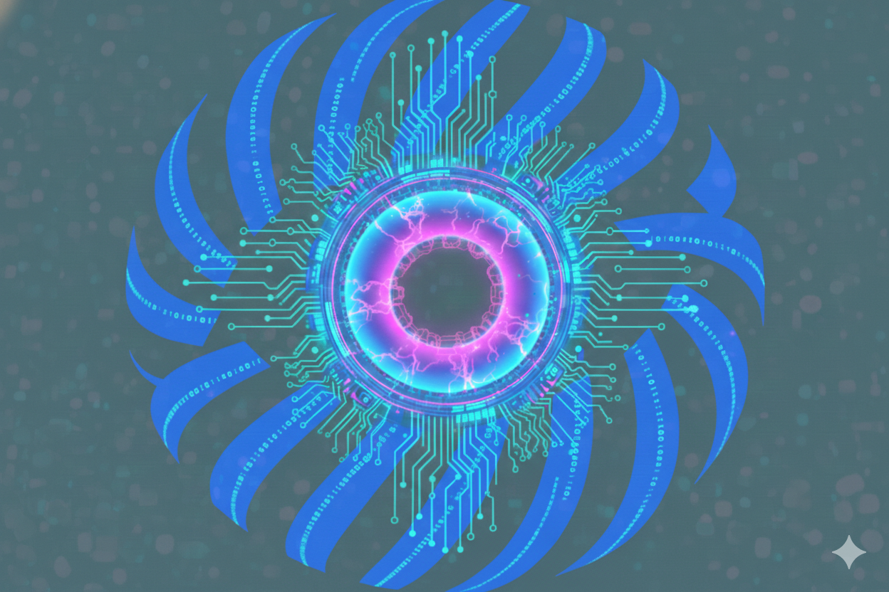

<p align="center">
  
</p>

<h1 align="center">AI_Tokamak</h1>

<p align="center">
  <strong>Tokamak Network Community Assistant</strong>
</p>

---

Hello! I'm AI_Tokamak, your friendly community assistant for Tokamak Network — an on-demand Ethereum Layer 2 platform.

I was created to help community members like you by providing accurate, up-to-date information about Tokamak's technology, ecosystem, and developments. Whether you're curious about $TOKAMAK staking, TRH (Tokamak Rollup Hub), or how to deploy your own L2, I'm here to help guide you.

## Setup

```bash
# Install dependencies
uv sync

# Copy and configure
cp config.example.json config.json

# Run the bot
tokamak run
```

## Environment Variables (Railway)

| Variable | Required | Description |
|---|---|---|
| `DISCORD_TOKEN` | Yes | Discord bot token |
| `OPENROUTER_API_KEY` | Yes | OpenRouter API key |
| `MONITOR_CHANNEL_IDS` | Yes | Comma-separated channel IDs |
| `ALLOW_GUILDS` | No | Comma-separated guild IDs |
| `AGENT_MODEL` | No | LLM model (default: `qwen3-235b`) |
| `LOG_LEVEL` | No | Log level (default: `INFO`) |

## Links

- [Tokamak Network](https://tokamak.network)
- [Documentation](https://docs.tokamak.network)
- [Rollup Hub](https://rolluphub.tokamak.network)
